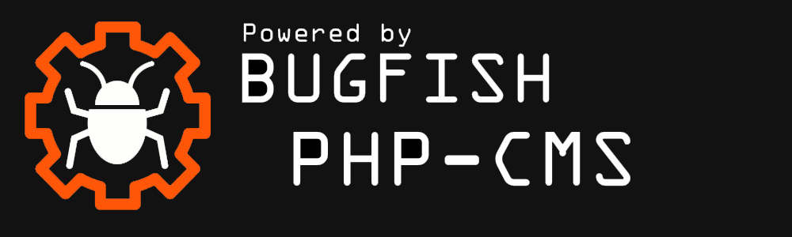

This project has been created with the "Bugfish Framework" and "Bugfish" CMS.

Documentation Bugfish Framework:  
https://www.bugfish-github.de/bugfish-framework  
Documentation bugfishCMS:  
https://www.bugfish-github.de/bugfish-cms    

# Online-Book-Renting (obr)
You can manage Books with informations to them and show them on a public page where people can see these books and maybe register to rent them or donate books. 

**This project is a module for the bugfish cms to always have the documentation for this template in hand! You can download this module out of your bugfishcms store if you are using the _administrator module!**

## Documentation
Look inside folders for readme and license informations! Documentations can be found in the docs folder. Just execute the index.html file in your webbrowser. (example: via drag and drop). The Book Rental Management System is a web application designed for managing a library's book rental operations, user and permission management, ISBN API connections, and multi-language support. This system allows you to efficiently rent books to users, set return deadlines, manage user permissions, and automate the process of adding books to the library database. You can find the documentation at www.bugfish.eu, besides  that there is a documentation inside the docs folder of this repository and at https://bugfishtm.github.io/Online-Book-Renting !  

You can find the Documentation here:  
https://bugfishtm.github.io/Online-Book-Renting/

You can find the Github Page here:  
https://github.com/bugfishtm/Online-Book-Renting

## Book Rental Management
- Rent books to users and set return deadlines.
- Track if users exceed the specified return deadlines and take necessary actions.
- Add notes and additional information, such as user deposits, for book security.

## User and Permission Management
- Differentiate between Administrator Users and Default Users.
- Administrator Users can access and manage all admin-related sections of the library.
- Default Users can request books, donate books, and view available books.
- Guests can view the entire collection of books without logging in.

## ISBN API Connections
- Enable ISBN API connections in the system settings to automatically retrieve book information and pre-fill book details from external APIs.

## Multi-Language Support
- Add new language files and change the default language settings in the website's interface.
- Allow users to set their preferred language.

## Installation
To install and set up the Book Rental Management System, please refer to the documentation provided in the "docs" folder. The documentation will guide you through the installation process.

## Repository Structure
- `.github`: Contains files related to sponsorship information.
- _source: Source code to deploy the web application.
- docs: Comprehensive website documentation.
- _releases: Releases of the software.
- _images: Images for the readme and about the project
- _changelog: Versioning Changelogs
- _licenses: licenses of 3rd Party Libraries included in this project

## Reporting Issues
If you encounter issues or have questions while using this software, please don't hesitate to contact us on our forum at www.bugfish.eu/forum.

## This Project Code Location
As this project has been made with a backend cms, most of the files are CMS - Related and belong not spefically to this project. This project has been delivered as a site module named "obr". You can find the Code in the websites "_site" folder!

## 3rd Party Libraries
In this project there has been used different 3rd party libraries (for example jQuery). All external Libraries are included in the websites /_vendor folder, as theire licenses. The project itself is made with the help of the "Bugfish Framework" and the "Bugfish" Backend CMS.

 

## License

For licensing information, please refer to the `license.md` file inside this repository's folder.