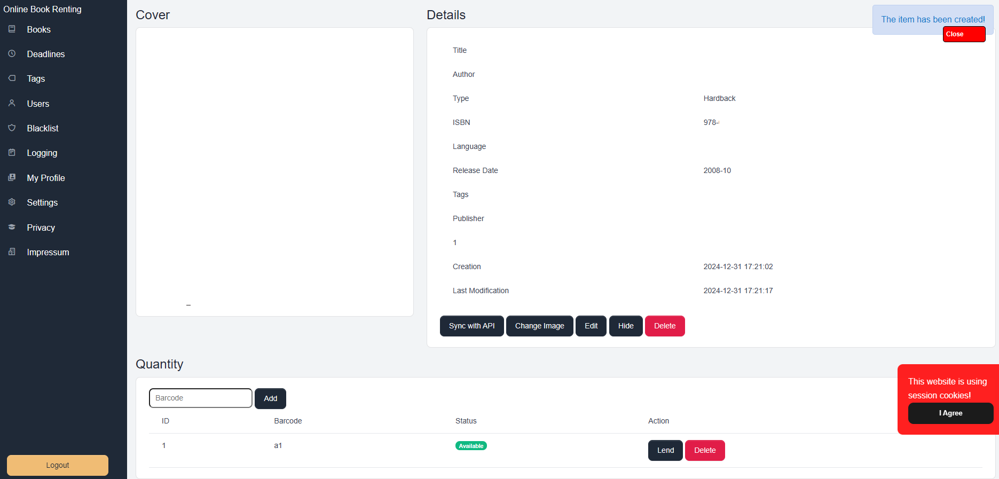

# Online-Book-Renting (OBR)

Manage, showcase, and share books effortlessly with Online-Book-Renting (OBR).

-----------

## Introduction

The Online-Book-Renting (obr) system allows you to manage books, display them on a public page, and enable users to rent or donate books.

 

### Features

#### Book Rental Management

| **Feature** | **Description** |
|-------------|-----------------|
| **Book Rental** | Rent books to users and set return deadlines. |
| **Deadline Tracking** | Monitor if users exceed return deadlines and manage necessary actions. |
| **Additional Information** | Add notes and user deposits for book security. |

#### ISBN API Connections

| **Feature** | **Description** |
|-------------|-----------------|
| **ISBN API** | Enable API connections to automatically retrieve and pre-fill book details. |

#### User Management

The software includes a powerful user management system, allowing administrators to create, manage, and organize users efficiently. This system helps ensure that user-related tasks are streamlined and secure.

#### Access Control

The software offers an advanced permission management system that allows you to define and control user access to specific features and resources. This helps maintain security and ensures that sensitive information is protected.

#### Multi-Language Support

This project supports multiple languages, including German, English, Spanish, Italian, French, Japanese, Chinese, Russian, Hindi, Portuguese, Korean, and Turkish. You can add new languages or modify existing text on the website by overriding translations.

#### Troubleshooting

The software comes with built-in debugging tools to help identify and resolve errors quickly. These features provide detailed logs and error reports, making it easier for developers to troubleshoot and enhance the software during the development process.

#### Powered by Suitefish

This project has been created with [Suitefish-CMS](https://github.com/bugfishtm/suitefish-cms). The Backend consists of a various set of Suitefish functionalities and the full included [Bugfish-Framework](https://github.com/bugfishtm/bugfish-framework).

  
  

-----------

## Screenshots  
Check out our [Screenshots Gallery](./screenshots.html) for a visual overview of the project. You’ll find images showcasing key features and user interface design, offering a preview of what to expect.

-----------

## Tutorials  
Visit the [Tutorials Page](./tutorials.html) for a collection of step-by-step guides that will help you get the most out of the project. These tutorials cover everything from installation to advanced functionality.

-----------

## Downloads  
The [Downloads Section](./download.html) provides all the necessary files to get started with the project, including the latest software versions and any related resources.

-----------

## Installation  
Follow the clear and detailed instructions in our [Installation Guide](./installation.html) to set up the project. This guide will help you get everything running smoothly on your system.

-----------

## Contributing  
Find out how you can contribute to the project by visiting the [Contributing Page](./contributing.html). Whether you want to report bugs, suggest features, or submit improvements, we welcome your involvement.

-----------

## Warranty  
Review the terms of our warranty on the [Warranty Information Page](./warranty.html). This page outlines the scope of support and any applicable guarantees.

-----------

## Support  
If you need assistance, visit the [Support Page](./support.html) to find the available channels for getting help with any issues or questions you might have.

-----------

## License  
Get the full details on licensing by checking out the [License Information Page](./license.html). This section includes the terms and conditions under which the project is distributed.